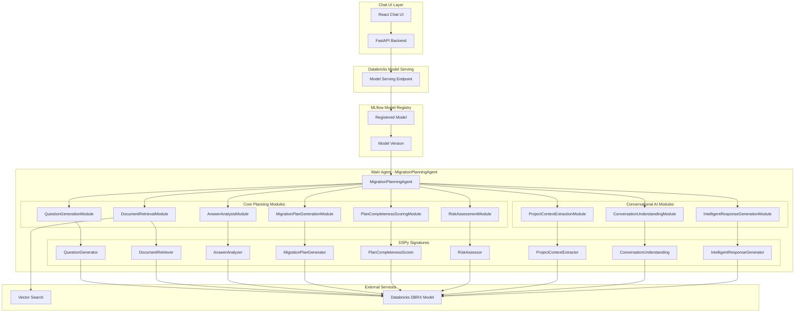

# Migration Planning Agent - DSPy Architecture

## Overview

This project implements a sophisticated AI agent for Oracle to Databricks migration planning using DSPy (Declarative Self-improving Python) framework. The agent provides conversational AI capabilities through a chat interface, intelligently guiding users through the migration planning process.

## Architecture Diagram



## Component Architecture

### 1. DSPy Signatures (AI Prompts)
DSPy signatures define the input/output structure and behavior for each AI task:

#### Core Planning Signatures
- **`QuestionGenerator`**: Generates relevant questions for migration planning categories
- **`DocumentRetriever`**: Retrieves relevant documents using vector search
- **`AnswerAnalyzer`**: Analyzes user answers and extracts insights
- **`MigrationPlanGenerator`**: Creates comprehensive migration plans
- **`PlanCompletenessScorer`**: Scores plan completeness and maturity
- **`RiskAssessor`**: Assesses risks and provides mitigation strategies

#### Conversational AI Signatures
- **`ProjectContextExtractor`**: Extracts structured context from user descriptions
- **`ConversationUnderstanding`**: Understands user intent and conversation flow
- **`IntelligentResponseGenerator`**: Generates natural, helpful responses

### 2. DSPy Modules (AI Components)
Modules wrap signatures with ChainOfThought reasoning:

#### Core Planning Modules
- **`QuestionGenerationModule`**: Generates questions for specific planning categories
- **`DocumentRetrievalModule`**: Retrieves relevant documents using vector search
- **`AnswerAnalysisModule`**: Analyzes answers and extracts key insights
- **`MigrationPlanGenerationModule`**: Generates comprehensive migration plans
- **`PlanCompletenessScoringModule`**: Scores plan completeness and maturity
- **`RiskAssessmentModule`**: Assesses risks and provides mitigation strategies

#### Conversational AI Modules
- **`ProjectContextExtractionModule`**: Extracts structured project context
- **`ConversationUnderstandingModule`**: Understands user intent and context
- **`IntelligentResponseGenerationModule`**: Generates intelligent responses

### 3. Main Agent - MigrationPlanningAgent
The orchestration agent that coordinates all modules:

```python
class MigrationPlanningAgent(dspy.Module):
    def __init__(self, vector_search_endpoint, vector_search_index):
        # Initialize all modules
        self.question_generator = QuestionGenerationModule()
        self.document_retriever = DocumentRetrievalModule(...)
        # ... other modules
        
    def process_user_input(self, user_input: str):
        """Main conversational interface"""
        # Handle different user intents
        # Coordinate appropriate modules
        # Return structured response
        
    def forward(self, inputs: str):
        """MLflow deployment interface"""
        # Convert process_user_input result to DSPy Prediction
```

## Data Flow

### 1. User Interaction Flow
```
User Input → Chat UI → FastAPI → Model Serving → MigrationPlanningAgent
                                                      ↓
Response ← Chat UI ← FastAPI ← Model Serving ← DSPy Prediction
```

### 2. Agent Processing Flow
```
User Input → Conversation Understanding → Intent Classification
                    ↓
Project Context Extraction (if first interaction)
                    ↓
Appropriate Module Selection:
- Question Generation
- Answer Analysis  
- Plan Generation
- Risk Assessment
                    ↓
Response Generation → DSPy Prediction
```

### 3. Planning Categories
The agent guides users through these planning categories:
- **Resource & Team**: Team composition, skills, roles
- **Technical Scope & Architecture**: Data volume, pipelines, architecture
- **Customer Background & Drivers**: Business drivers, timeline, constraints
- **Current Process Maturity**: Existing processes, tools, practices
- **Performance & Scalability**: Performance requirements, scaling needs
- **Security & Compliance**: Security requirements, compliance needs

## Key Features

### 1. Conversational AI
- **Natural Language Understanding**: Users can start with "I need to migrate Oracle to Databricks"
- **Context Awareness**: Maintains conversation state and project context
- **Intent Recognition**: Understands different user intents (questions, answers, requests)
- **Intelligent Responses**: Generates helpful, contextual responses

### 2. Progressive Planning
- **Category-based Questions**: Asks relevant questions for each planning category
- **Context Building**: Builds understanding progressively through conversation
- **Plan Generation**: Creates comprehensive migration plans when ready
- **Completeness Scoring**: Tracks plan maturity and completeness

### 3. Vector Search Integration
- **Document Retrieval**: Retrieves relevant migration documents
- **Knowledge Base**: Uses vector search for contextual information
- **RAG (Retrieval Augmented Generation)**: Enhances responses with relevant documents

### 4. MLflow Integration
- **Model Registry**: Models are registered in Unity Catalog
- **Model Serving**: Deployed to Databricks Model Serving
- **Versioning**: Supports model versioning and A/B testing
- **Monitoring**: Built-in model monitoring and logging

## Input/Output Format

### Input Format
```json
{
  "inputs": "I need to migrate our Oracle data warehouse to Databricks"
}
```

### Output Format
```json
{
  "predictions": [
    {
      "response": "Great! I understand you're working on: Oracle data warehouse migration to Databricks\n\nLet me help you plan this migration. I'll start by asking some questions about Resource & Team.\n\n1. How many team members are there and what are their roles?\n2. Are the teams sufficiently skilled/trained in Databricks?\n3. Are they using Professional Services or System Integrators?\n4. Are resources shared with other projects?\n5. Have resources done this type of migration work before?",
      "type": "initialization",
      "questions": "1. How many team members are there and what are their roles?\n2. Are the teams sufficiently skilled/trained in Databricks?\n3. Are they using Professional Services or System Integrators?\n4. Are resources shared with other projects?\n5. Have resources done this type of migration work before?",
      "category": "Resource & Team"
    }
  ]
}
```

## Deployment Architecture

### 1. Databricks Bundle Structure
```
bundles/
├── ai-agent/
│   ├── databricks.yml          # Bundle configuration
│   └── notebooks/
│       └── migration_planning_agent.py
└── data-pipeline/
    ├── databricks.yml
    └── notebooks/
        ├── process_documents.py
        └── create_vector_index.py
```

### 2. Model Deployment
- **Training**: Notebook trains and registers model in MLflow
- **Serving**: Model deployed to Databricks Model Serving
- **UI Integration**: FastAPI backend queries serving endpoint
- **Chat Interface**: React frontend provides conversational UI

### 3. Dependencies
- **DSPy**: Core AI framework
- **Databricks DBRX**: Language model
- **Vector Search**: Document retrieval
- **MLflow**: Model management
- **FastAPI**: Backend API
- **React**: Frontend UI

## Configuration

### Environment Variables
- `SERVING_ENDPOINT_NAME`: Name of the model serving endpoint
- `VECTOR_SEARCH_ENDPOINT`: Vector search endpoint name
- `VECTOR_INDEX_NAME`: Vector index name
- `MLFLOW_EXPERIMENT_NAME`: MLflow experiment name

### Databricks Bundle Variables
```yaml
variables:
  catalog_name: "vbdemos"
  schema_name: "usecase_agent"
  vector_search_endpoint: "usecase-agent"
  vector_index_name: "vbdemos.usecase_agent.migration_planning_documents"
  migration_documents_table: "vbdemos.usecase_agent.migration_documents"
  agent_model: "databricks-dbrx-instruct"
  temperature: "0.1"
  max_tokens: "2048"
  mlflow_experiment_name: "/Users/varun.bhandary@databricks.com/usecase-agent"
```

## Usage

### 1. Training the Model
```bash
# Deploy the bundle
databricks bundle deploy

# Run the training job
databricks bundle run migration_planning_agent_job
```

### 2. Testing the Model
```bash
# Test via Databricks UI
# Go to Serving → Your Endpoint → Test
# Input: {"inputs": "I need to migrate Oracle to Databricks"}
```

### 3. Chat UI
```bash
# Start the UI
cd ui
npm install
npm start

# Access at http://localhost:3000
```

## Key Benefits

1. **Conversational**: Natural language interaction
2. **Intelligent**: Context-aware responses
3. **Progressive**: Builds understanding step by step
4. **Comprehensive**: Covers all migration planning aspects
5. **Scalable**: Built on Databricks platform
6. **Maintainable**: Clean DSPy architecture
7. **Extensible**: Easy to add new capabilities

## Future Enhancements

1. **Multi-language Support**: Support for different languages
2. **Custom Categories**: User-defined planning categories
3. **Template Library**: Pre-built migration templates
4. **Integration**: Connect with project management tools
5. **Analytics**: Track planning progress and outcomes
6. **Collaboration**: Multi-user planning sessions

---

This architecture provides a robust, scalable, and maintainable solution for AI-powered migration planning with conversational capabilities.
