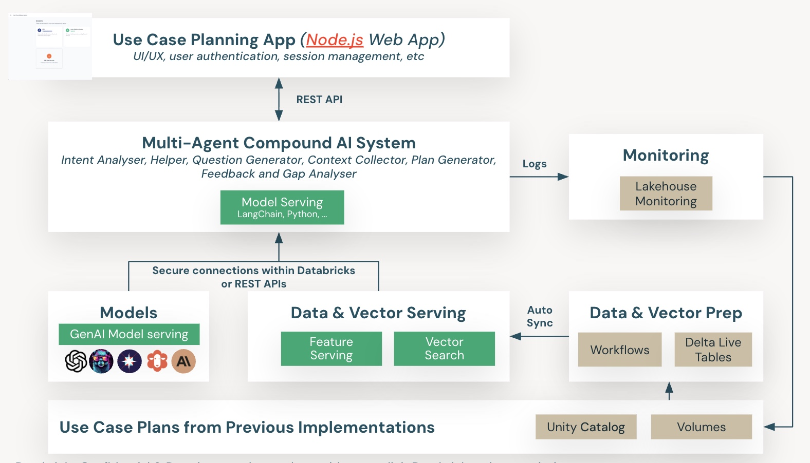
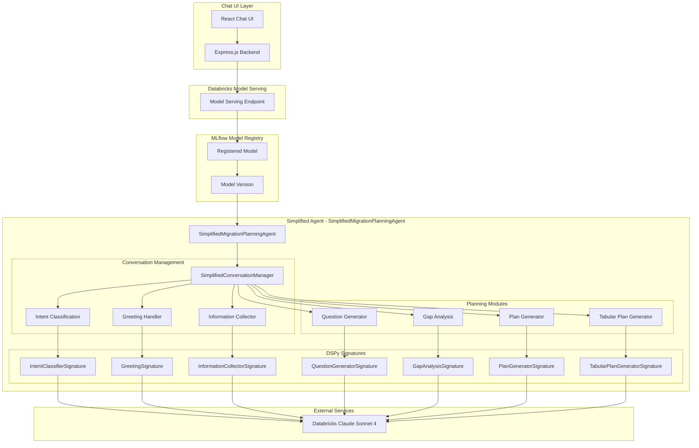

# Use Case Delivery Agent - Simplified DSPy Architecture

## Overview

This project implements a AI agent for Databricks account teams to create use case plans for customer migrations and greenfield scenarios. The agent uses DSPy (Declarative Self-improving Python) framework with MLflow's built-in conversation management, providing conversational AI capabilities through a chat interface to intelligently guide account teams through use case planning.

## High-Level Architecture Overview



*Figure 1: High-level system architecture showing the multi-agent compound AI system, web application, model serving, and data pipeline components.*

## Detailed Architecture Diagram



## Component Architecture

### 1. DSPy Signatures (AI Prompts)
DSPy signatures define the input/output structure and behavior for each AI task:

#### Core Planning Signatures

- **`IntentClassifierSignature`**: Classifies user intent (greeting, providing_context, answering_questions, feedback_request, plan_generation)
- **`GreetingSignature`**: Handles greetings and explains capabilities for Databricks account teams
- **`InformationCollectorSignature`**: Extracts and structures customer use case information
- **`QuestionGeneratorSignature`**: Generates exactly 3 relevant questions for gathering customer information
- **`GapAnalysisSignature`**: Analyzes information completeness and identifies gaps
- **`PlanGeneratorSignature`**: Generates comprehensive tabular use case plans
- **`TabularPlanGeneratorSignature`**: Creates detailed implementation plans with phases, activities, and timelines

### 2. Simplified Conversation Manager
The `SimplifiedConversationManager` handles all conversation logic using MLflow's built-in context management:

```python
class SimplifiedConversationManager:
    def __init__(self, lm, rm):
        # Initialize DSPy components with selective Chain of Thought strategy
        self.intent_classifier = dspy.Predict(IntentClassifierSignature)
        self.greeting_handler = dspy.Predict(GreetingSignature)
        self.information_collector = dspy.Predict(InformationCollectorSignature)
        self.question_generator = dspy.ChainOfThought(QuestionGeneratorSignature)
        self.gap_analyzer = dspy.ChainOfThought(GapAnalysisSignature)
        self.plan_generator = dspy.ChainOfThought(PlanGeneratorSignature)
        self.tabular_plan_generator = dspy.ChainOfThought(TabularPlanGeneratorSignature)
        
    def process_user_input(self, user_input: str, context: Optional[Dict], user_id: str, conversation_id: str):
        """Process user input with conversation context"""
        # Classify intent and route to appropriate handler
        # Update conversation state
        # Return structured response
```

### 3. Main Agent - SimplifiedMigrationPlanningAgent
The simplified orchestration agent using MLflow's ResponsesAgent:

```python
class SimplifiedMigrationPlanningAgent(ResponsesAgent):
    def __init__(self):
        super().__init__()
        self.conversation_manager = SimplifiedConversationManager(lm, rm)
        
    def predict(self, request: ResponsesAgentRequest) -> ResponsesAgentResponse:
        """Process request using MLflow's built-in context management"""
        # Extract user input and context
        # Process with conversation manager
        # Return MLflow-compatible response
```

## Data Flow

### 1. User Interaction Flow

```
User Input → Chat UI → Express.js Backend → Model Serving → SimplifiedMigrationPlanningAgent
                                                      ↓
Response ← Chat UI ← Express.js Backend ← Model Serving ← MLflow ResponsesAgentResponse
```

### 2. Agent Processing Flow

```
User Input → Intent Classification → Route to Handler:
                    ↓
- Greeting Handler (for greetings)
- Information Collector (for context/answers)
- Question Generator (for follow-up questions)
- Gap Analyzer (for feedback requests)
- Plan Generator (for plan generation)
                    ↓
Response Generation → MLflow ResponsesAgentResponse
```

### 3. Planning Categories

The agent guides account teams through these planning categories:

- **Resource & Team**: Team composition, skills, roles, training
- **Customer Background & Drivers**: Business drivers, timeline, constraints, cloud adoption
- **Technical Scope & Architecture**: Data volume, pipelines, architecture, migration approach
- **Current Process Maturity**: Existing processes, tools, practices, governance
- **Performance & Scalability**: Performance requirements, scaling needs, bottlenecks
- **Security & Compliance**: Security requirements, compliance standards, access control

## Key Features

### 1. Conversational AI

- **Natural Language Understanding**: Account teams can start with "I'm working with a customer who wants to migrate from Oracle"
- **Context Awareness**: Maintains conversation state and customer context using MLflow's built-in management
- **Intent Recognition**: Understands different user intents (greeting, providing_context, answering_questions, feedback_request, plan_generation)
- **Intelligent Responses**: Generates helpful, contextual responses for account teams

### 2. Progressive Planning

- **Category-based Questions**: Asks exactly 3 relevant questions for each planning category
- **Context Building**: Builds understanding progressively through conversation
- **Plan Generation**: Creates comprehensive tabular use case plans when ready
- **Gap Analysis**: Tracks information completeness and identifies missing areas

### 3. Simplified Architecture

- **MLflow Integration**: Uses MLflow's built-in conversation management
- **Reduced Complexity**: ~70% less code than the original implementation
- **Better Performance**: Selective Chain of Thought strategy for optimal performance
- **Easier Debugging**: Built-in debug information and MLflow's native tracing

### 4. MLflow Integration

- **Model Registry**: Models are registered in Unity Catalog
- **Model Serving**: Deployed to Databricks Model Serving
- **Versioning**: Supports model versioning and A/B testing
- **Monitoring**: Built-in model monitoring and logging

## Input/Output Format

### Input Format
```json
{
  "input": [
    {
      "role": "user",
      "content": "I'm working with a customer who wants to migrate from Oracle to Databricks"
    }
  ],
  "context": {
    "conversation_id": "conv_123",
    "user_id": "user_456"
  }
}
```

### Output Format
```json
{
  "output": [
    {
      "id": "output_789",
      "type": "output_text",
      "content": [
        {
          "type": "output_text",
          "text": "Hello! I'm here to help you create a comprehensive use case plan for your customer's migration from Oracle to Databricks.\n\nTo help me create the best plan, could you tell me more about:\n\n1. How many team members are there and what are their roles?\n2. Are the teams sufficiently skilled/trained in Databricks?\n3. Are they using Professional Services or System Integrators?\n\n*Category: Resource & Team*"
        }
      ]
    }
  ]
}
```

## Deployment Architecture

### 1. Databricks Bundle Structure
```
bundles/
├── ai-agent/
│   ├── databricks.yml          # Bundle configuration
│   └── notebooks/
│       ├── mvp_migration_planning_agent.py
│       └── simplified_migration_planning_agent.py
└── data-pipeline/
    ├── databricks.yml
    └── notebooks/
        ├── process_documents.py
        └── create_vector_index.py
```

### 2. Model Deployment
- **Training**: Notebook trains and registers model in MLflow
- **Serving**: Model deployed to Databricks Model Serving
- **UI Integration**: Express.js backend queries serving endpoint
- **Chat Interface**: React frontend provides conversational UI

### 3. Dependencies
- **DSPy**: Core AI framework
- **Databricks Claude Sonnet 4**: Language model
- **MLflow**: Model management and conversation tracking
- **Express.js**: Backend API
- **React**: Frontend UI

## Configuration

### Environment Variables
- `DATABRICKS_TOKEN`: Databricks access token for API authentication
- `PORT`: Server port (default: 5000)
- `NODE_ENV`: Environment (development/production)

### Databricks Bundle Variables
```yaml
variables:
  catalog_name: "vbdemos"
  schema_name: "usecase_agent"
  agent_model: "databricks/databricks-claude-sonnet-4"
  temperature: "0.1"
  max_tokens: "2048"
  mlflow_experiment_name: "/Users/varun.bhandary@databricks.com/usecase-agent"
```

### Model Configuration
- **Language Model**: `databricks/databricks-claude-sonnet-4`
- **Temperature**: 0.1 (for consistent responses)
- **Max Tokens**: 2048
- **DSPy Strategy**: Selective Chain of Thought (simple tasks use `dspy.Predict`, complex tasks use `dspy.ChainOfThought`)

## Usage

### 1. Training the Model
```bash
# Deploy the bundle
databricks bundle deploy

# Run the simplified agent training
databricks bundle run simplified_migration_planning_agent_job
```

### 2. Testing the Model
```bash
# Test via Databricks UI
# Go to Serving → simplified-migration-planning-agent → Test
# Input: {"input": [{"role": "user", "content": "I'm working with a customer who wants to migrate from Oracle to Databricks"}], "context": {"conversation_id": "test_123", "user_id": "test_user"}}
```

### 3. Chat UI
```bash
# Set up environment variables
export DATABRICKS_TOKEN=your_token_here

# Start the backend
cd ui-backend
npm install
npm start

# Start the frontend (in another terminal)
cd ui-frontend
npm install
npm start

# Access at http://localhost:3000
```

### 4. Using the Simplified Server
```bash
# Use the simplified server for better MLflow integration
cd ui-backend
node simplified_server.js
```

## Key Benefits

1. **Simplified Architecture**: ~70% less code, easier to maintain and debug
2. **MLflow Integration**: Built-in conversation management and context tracking
3. **Better Performance**: Selective Chain of Thought strategy for optimal speed
4. **Conversational**: Natural language interaction for account teams
5. **Intelligent**: Context-aware responses with customer focus
6. **Progressive**: Builds understanding step by step through structured questions
7. **Comprehensive**: Covers all use case planning aspects
8. **Scalable**: Built on Databricks platform with Unity Catalog
9. **Extensible**: Easy to add new capabilities and question categories

## Key Simplifications Made

1. **Removed Custom Session Management**: Uses MLflow's built-in context management
2. **Simplified Request Handling**: Uses standard ResponsesAgentRequest structure
3. **Cleaner Architecture**: Single ConversationManager class with in-memory storage
4. **Better MLflow Integration**: Leverages MLflow's conversation tracking
5. **Enhanced DSPy Signatures**: Improved with detailed examples and better descriptions
6. **Fixed DSPy Configuration**: Proper configuration for model serving compatibility
7. **Reduced Complexity**: Easier to maintain and debug

## Future Enhancements

1. **Multi-language Support**: Support for different languages
2. **Custom Categories**: User-defined planning categories
3. **Template Library**: Pre-built use case templates
4. **Integration**: Connect with CRM and project management tools
5. **Analytics**: Track planning progress and outcomes
6. **Collaboration**: Multi-user planning sessions
7. **Vector Search**: Add document retrieval for enhanced knowledge base

---

This simplified architecture provides a robust, scalable, and maintainable solution for AI-powered use case planning with conversational capabilities specifically designed for Databricks account teams.
