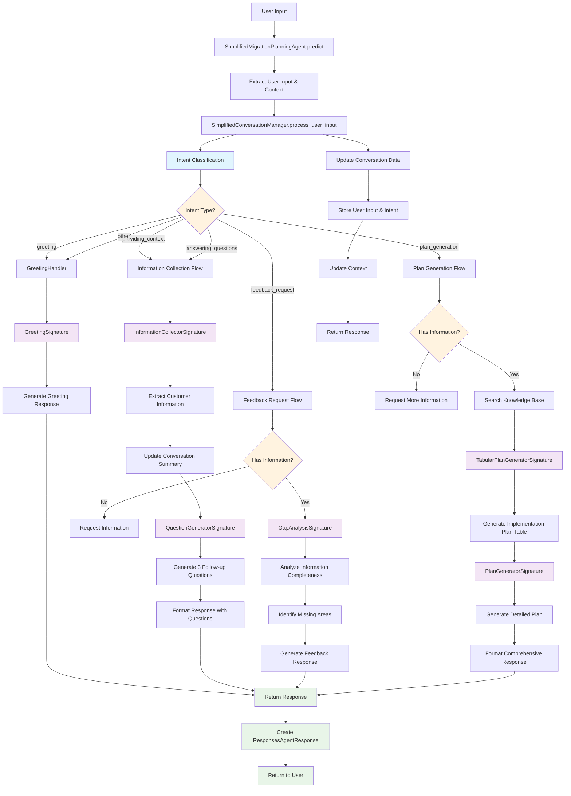

# Simplified Migration Planning Agent - Response Flow Diagram

## Overview
This diagram shows the complete response flow of the Simplified Migration Planning Agent, from user input to final response generation.

## Response Flow Diagram



## Detailed Component Breakdown

### 1. Entry Point
- **SimplifiedMigrationPlanningAgent.predict()**: Main entry point that receives ResponsesAgentRequest
- Extracts user input, user ID, and conversation context
- Delegates to SimplifiedConversationManager

### 2. Intent Classification
- **IntentClassifierSignature**: Classifies user intent into categories:
  - `greeting`: Initial interaction
  - `providing_context`: Sharing customer information
  - `answering_questions`: Responding to follow-up questions
  - `feedback_request`: Asking for status/feedback
  - `plan_generation`: Requesting plan generation
  - `other`: Fallback to greeting

### 3. Response Flows

#### A. Greeting Flow
- **GreetingSignature**: Generates welcome message explaining agent capabilities
- Used for initial interactions and unknown intents

#### B. Information Collection Flow
- **InformationCollectorSignature**: Extracts structured customer information
- Updates conversation summary with new information
- **QuestionGeneratorSignature**: Generates 3 targeted follow-up questions
- Uses predefined question categories (Resource & Team, Customer Background, etc.)

#### C. Feedback Request Flow
- **GapAnalysisSignature**: Analyzes information completeness
- Identifies missing areas for better planning
- Provides status update on information collection

#### D. Plan Generation Flow
- **TabularPlanGeneratorSignature**: Creates detailed implementation plan table
- **PlanGeneratorSignature**: Generates comprehensive plan with assumptions and risks
- Includes timeline, resource requirements, and risk assessment

### 4. Conversation Management
- Maintains conversation state per user/session
- Stores user inputs with timestamps and intents
- Updates context with recent conversation history
- Uses conversation ID for session isolation

### 5. Question Categories
The agent uses structured question categories:
- **Resource & Team**: Team size, skills, experience
- **Customer Background & Drivers**: Deadlines, cloud usage, business drivers
- **Technical Scope & Architecture**: Pilot status, data visibility, migration approach
- **Current Process Maturity**: Governance, architecture, security processes
- **Performance & Scalability**: Requirements, growth, bottlenecks
- **Security & Compliance**: Requirements, standards, audit needs

## Key Features

1. **Context-Aware**: Maintains conversation history and context
2. **Intent-Driven**: Routes responses based on user intent
3. **Progressive Information Gathering**: Asks targeted follow-up questions
4. **Comprehensive Planning**: Generates detailed implementation plans
5. **Session Management**: Isolates conversations per user/session
6. **Structured Output**: Uses markdown tables and formatted responses

## Response Examples

### Greeting Response
```
Hello! I'm here to help Databricks account teams create comprehensive use case plans for customer migrations and greenfield scenarios. I can help you gather information about your customer's current setup, requirements, and goals, then generate detailed implementation plans.

What can you tell me about your customer's migration project?
```

### Information Collection Response
```
Thank you for sharing that information!

To help me create a better plan, could you tell me more about:

1. How many team members are there and what are their roles?
2. Does the customer have a specific deadline and what drives it?
3. Has a pilot or POC been conducted?

*Category: Resource & Team*
```

### Plan Generation Response
```
# Customer Use Case Implementation Plan

## Implementation Plan Table
[Detailed markdown table with phases, activities, timelines, deliverables]

## Detailed Implementation Timeline
[Comprehensive timeline with dependencies and owners]

## Resource Requirements
[Team roles, skills, and effort estimates]

## Key Assumptions
[Assumptions made about customer environment]

## Risk Assessment & Mitigation
[Identified risks and mitigation strategies]
```

